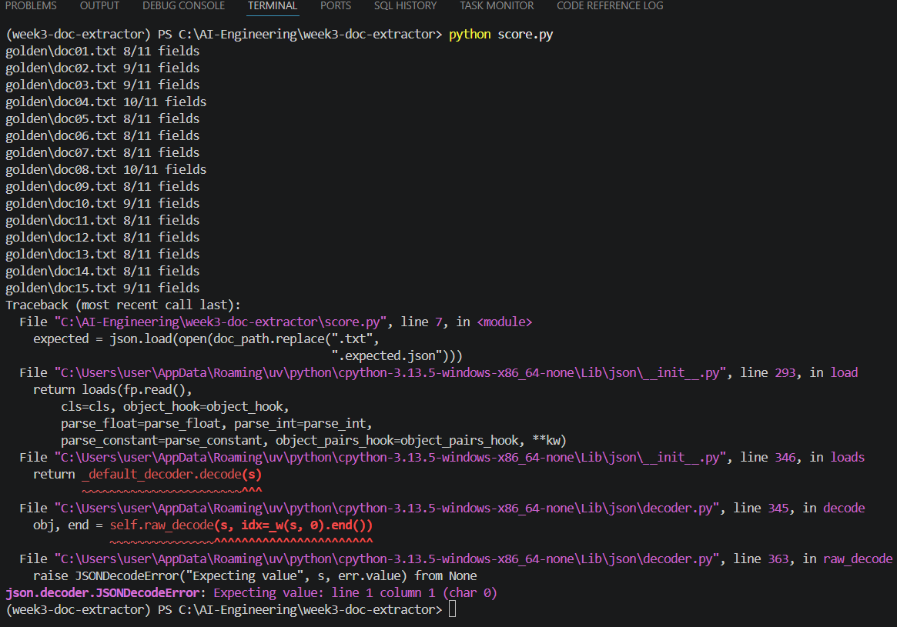
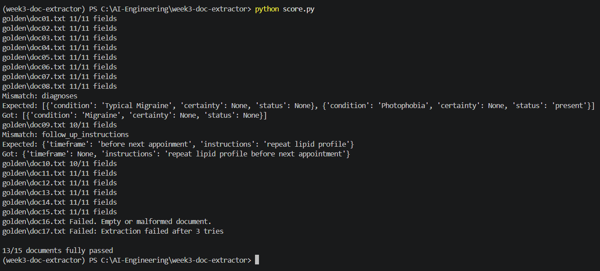

# Overview
This project is an AI-powered document extraction pipeline that converts unstructured telemedicine consultation notes into structured JSON data.  
The system uses a Large Language Model (LLM) with prompt engineering and Pydantic validation to extract clinical and administrative information while maintaining a consistent output schema.

### Domain

**Healthcare / Telemedicine Clinical Data Extraction**

The extractor is designed for telemedicine consultation documents containing information such as:

- Patient demographics
- Consultation details
- Symptoms and medical history
- Diagnoses and diagnostic confidence
- Medications and prescriptions
- Treatment plans
- Follow-up instructions

The goal is to transform free-text medical notes into structured data suitable for downstream healthcare applications such as clinical records, analytics, and automated documentation systems.

### Contents
extractor.py: LLM extraction pipeline  
schema.py: Pydantic output validation models  
score.py: Field-level accuracy evaluation  
  
prompts/  
    extract_v1.txt: Original extraction prompt  
    extract_v2.txt: Improved extraction prompt  

golden/  
    doc01.txt: Test documents  
    doc01.expected.json: Expected outputs
    ...

few_shot_examples.txt: Few-shot examples for edge cases  

### Setup
1. Clone the repository:  
git clone https://github.com/rachellvns/week3-doc-extractor  
cd week3-doc-extractor  
2. Create virtual environment Python  
.venv\Scripts\Activate  
3. Install dependencies  
pip install anthropic pydantic python -dotenv  
4. Create a .env file in the project root  
5. Run the extractor or the score
python extractor.py  
python score.py 

## Scores before refining (note: doc16 is an empty document)
Before refining and before adding empty and malformed-doc handling (no full score and an error (because of empty file))

## Scores after refining (note: doc16 is an empty document & doc17 is a malformed document)
After refining prompt, adding more examples, graceful empty and malformed-doc handling
(13/15 full score and seamless error handling)
